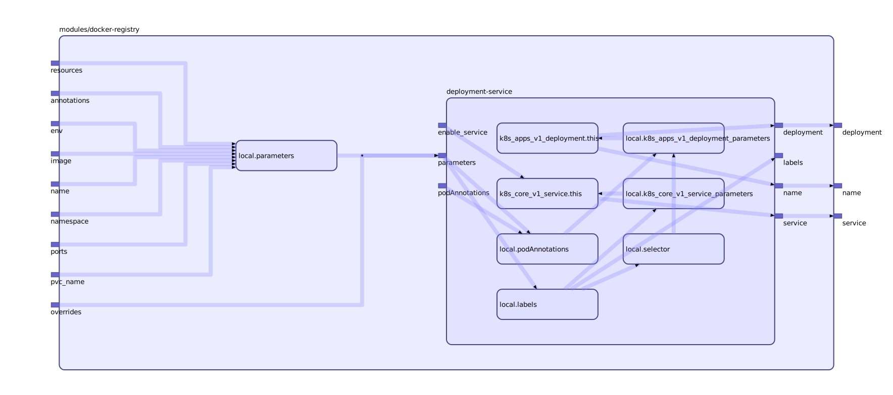

To view the full size interactive diagram, append ```?sanitize=true``` to the raw URL.

[Docker Registry](https://docs.docker.com/registry/)

## Inputs

| Name | Description | Type | Default | Required |
|------|-------------|:----:|:-----:|:-----:|
| name |  | string | n/a | yes |
| storage |  | string | n/a | yes |
| storage\_class\_name |  | string | n/a | yes |
| annotations |  | map | `{}` | no |
| dns\_policy |  | string | `""` | no |
| image |  | string | `"registry:2"` | no |
| namespace |  | string | `""` | no |
| node\_selector |  | map | `{}` | no |
| port |  | string | `"5000"` | no |
| priority\_class\_name |  | string | `""` | no |
| replicas |  | string | `"1"` | no |
| restart\_policy |  | string | `""` | no |
| scheduler\_name |  | string | `""` | no |
| service\_account\_name |  | string | `""` | no |
| service\_type |  | string | `""` | no |
| session\_affinity |  | string | `""` | no |
| termination\_grace\_period\_seconds |  | string | `"30"` | no |
| volume\_claim\_template\_name |  | string | `"pvc"` | no |

## Outputs

| Name | Description |
|------|-------------|
| cluster\_ip |  |
| name |  |
| port |  |
| statefulset\_uid |  |

