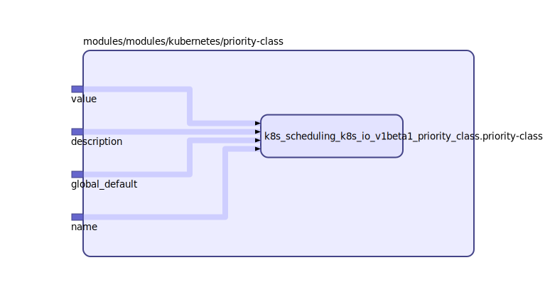

To view the full size interactive diagram, append ```?sanitize=true``` to the raw URL.

PriorityClass defines mapping from a priority class name to the priority integer value.
The value can be any valid integer.

Module usage:

    module "priority-class" {
      source         = "git::https://github.com/mingfang/terraform-provider-k8s.git//modules/kubernetes/priority-class"
      name           = "normal"
      value          = 50
      description    = "Normal Priority"
      global_default = true
    }

## Inputs

| Name | Description | Type | Default | Required |
|------|-------------|:----:|:-----:|:-----:|
| name |  | string | n/a | yes |
| value | The value of this priority class. This is the actual priority that podsreceive when they have the name of this class in their pod spec. | string | n/a | yes |
| description | description is an arbitrary string that usually provides guidelines on when this priority class should be used. | string | `""` | no |
| global\_default | globalDefault specifies whether this PriorityClass should be considered asthe default priority for pods that do not have any priority class. Only onePriorityClass can be marked as `globalDefault`. However, if more than onePriorityClasses exists with their `globalDefault` field set to true, thesmallest value of such global default PriorityClasses will be used as thedefault priority. | string | `"false"` | no |

