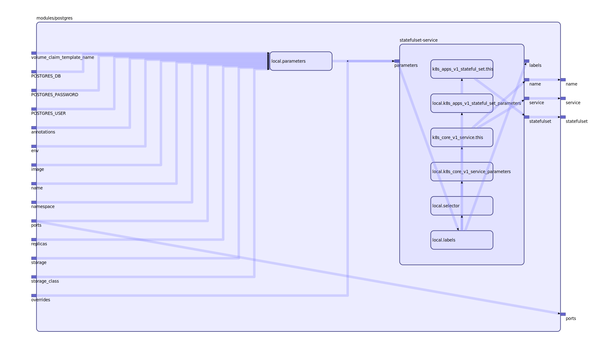

To view the full size interactive diagram, append ```?sanitize=true``` to the raw URL.

Module usage:

    module "postgres" {
      source             = "git::https://github.com/mingfang/terraform-provider-k8s.git//modules/postgres"
      name               = "test-postgres"
      postgres_user      = "postgres"
      postgres_password  = "postgres"
      postgres_db        = "postgres"

      storage_class_name = "test-postgres"
      storage            = "100Gi"
      replicas           = "${k8s_core_v1_persistent_volume.test-postgres.count}"
    }

    resource "k8s_core_v1_persistent_volume" "test-postgres" {
      count = 1

      metadata {
        name = "pvc-test-postgres-${count.index}"
      }

      spec {
        storage_class_name               = "test-postgres"
        persistent_volume_reclaim_policy = "Retain"

        access_modes = [
          "ReadWriteMany",
        ]

        capacity {
          storage = "100Gi"
        }

        cephfs {
          user = "admin"

          monitors = [
            "192.168.2.89",
            "192.168.2.39",
          ]

          secret_ref {
            name = "ceph-secret"
            namespace = "default"
          }
        }
      }
    }

## Inputs

| Name | Description | Type | Default | Required |
|------|-------------|:----:|:-----:|:-----:|
| name |  | string | n/a | yes |
| postgres\_db |  | string | n/a | yes |
| postgres\_password |  | string | n/a | yes |
| postgres\_user |  | string | n/a | yes |
| storage |  | string | n/a | yes |
| storage\_class\_name |  | string | n/a | yes |
| image |  | string | `"postgres"` | no |
| namespace |  | string | `"default"` | no |
| node\_selector |  | map | `{}` | no |
| port |  | string | `"5432"` | no |
| replicas |  | string | `"1"` | no |
| volume\_claim\_template\_name |  | string | `"pvc"` | no |

## Outputs

| Name | Description |
|------|-------------|
| name |  |
| port |  |

