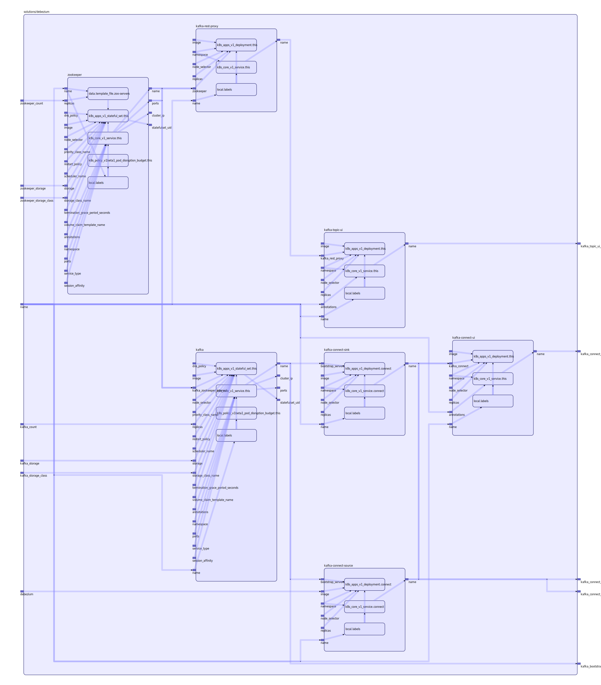

To view the full size interactive diagram, append ```?sanitize=true``` to the raw URL.

[Debezium](https://debezium.io)

This solution sets up:
- a [Kafka](https://kafka.apache.org) cluster
- a [Zookeeper](https://zookeeper.apache.org) cluster
- two [Kafka Connect](https://docs.confluent.io/current/connect/index.html) instances (one for source and another for sink).
- [Kafka Connect UI](http://kafka-connect-ui.landoop.com)
- [Kafka Topic UI](http://kafka-topics-ui.landoop.com)

Examples:
- [Sync MySql to Elasticsearch](https://github.com/mingfang/terraform-provider-k8s/tree/master/examples/debezium-mysql-elasticsearch)
- [Sync Postgres to Elasticsearch](https://github.com/mingfang/terraform-provider-k8s/tree/master/examples/debezium-postgres-elasticsearch)

## Inputs

| Name | Description | Type | Default | Required |
|------|-------------|:----:|:-----:|:-----:|
| kafka\_count |  | string | n/a | yes |
| kafka\_storage |  | string | n/a | yes |
| kafka\_storage\_class |  | string | n/a | yes |
| name |  | string | n/a | yes |
| zookeeper\_count |  | string | n/a | yes |
| zookeeper\_storage |  | string | n/a | yes |
| zookeeper\_storage\_class |  | string | n/a | yes |
| debezium-version |  | string | `"0.9"` | no |

## Outputs

| Name | Description |
|------|-------------|
| kafka\_bootstrap\_servers |  |
| kafka\_connect\_sink |  |
| kafka\_connect\_source |  |
| kafka\_connect\_ui\_name |  |
| kafka\_topic\_ui\_name |  |

