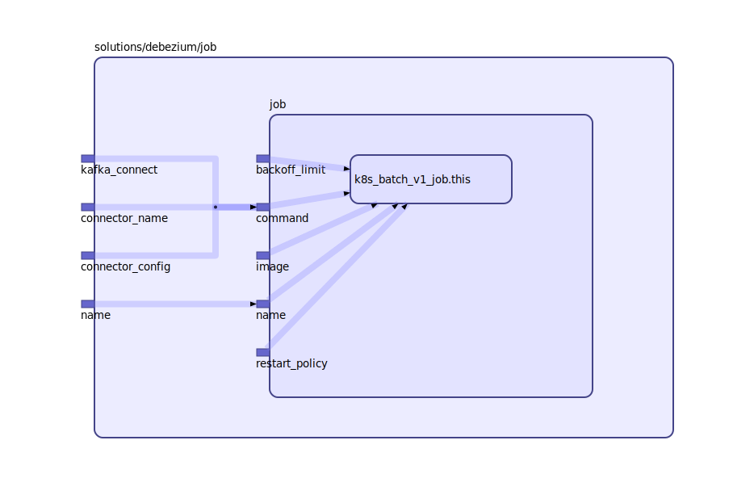

To view the full size interactive diagram, append ```?sanitize=true``` to the raw URL.

Use this module to run a job to configure the source and sink connectors

## Inputs

| Name | Description | Type | Default | Required |
|------|-------------|:----:|:-----:|:-----:|
| connector\_config |  | string | n/a | yes |
| connector\_name |  | string | n/a | yes |
| kafka\_connect |  | string | n/a | yes |
| name |  | string | n/a | yes |

