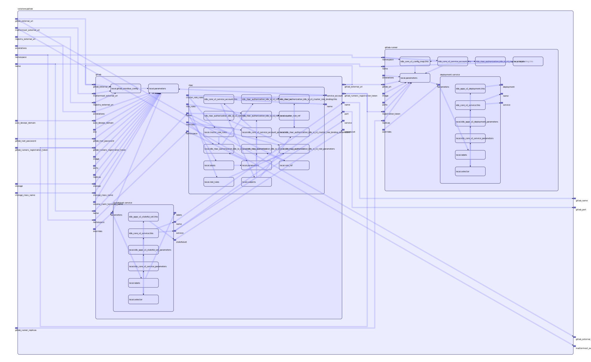

To view the full size interactive diagram, append ```?sanitize=true``` to the raw URL.

## Inputs

| Name | Description | Type | Default | Required |
|------|-------------|:----:|:-----:|:-----:|
| auto\_devops\_domain |  | string | n/a | yes |
| gitlab\_external\_url |  | string | n/a | yes |
| gitlab\_root\_password |  | string | n/a | yes |
| gitlab\_runners\_registration\_token |  | string | n/a | yes |
| mattermost\_external\_url |  | string | n/a | yes |
| name |  | string | n/a | yes |
| registry\_external\_url |  | string | n/a | yes |
| storage |  | string | n/a | yes |
| storage\_class\_name |  | string | n/a | yes |
| annotations |  | map | `{}` | no |
| gitlab\_runner\_replicas |  | string | `"1"` | no |
| namespace |  | string | `""` | no |

## Outputs

| Name | Description |
|------|-------------|
| gitlab\_external\_url |  |
| gitlab\_name |  |
| gitlab\_port |  |
| mattermost\_external\_url |  |

